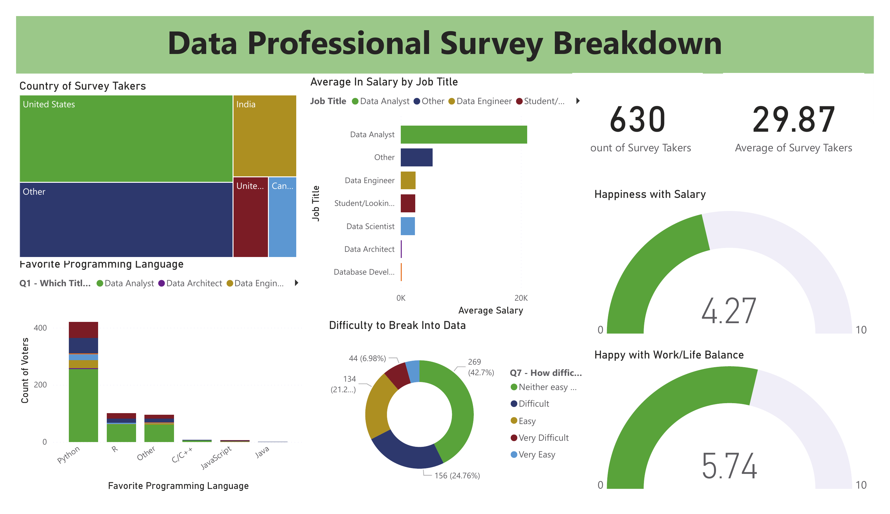

# Data-Professional-Survey-Dashboard

## 📊 Project Overview
This project presents an interactive Power BI dashboard that analyzes survey data from data professionals around the world.  
The dashboard provides insights into job roles, salaries, programming languages, geographic distribution, and job satisfaction.

Inspired by this YouTube tutorial:  
https://youtu.be/pixlHHe_lNQ?si=fJr9Qgmzebl-Kggx

## 🎯 Objectives
- Analyze survey data of data professionals.
- Explore salary distribution by job title.
- Identify the most popular programming languages.
- Measure satisfaction with salary and work-life balance.
- Build a professional and interactive Power BI dashboard.

## 📂 Project Files
- `Data_Professional_Survey.pbix` — Power BI dashboard file  
- `dataset.xlsx` — Survey dataset  
- `README.md` — Project documentation
- `dashboard.png` — Dashboard Preview

## 💡 Key Insights
- Most respondents are from the United States.
- Salaries vary across data roles.
- Python is the most preferred language.
- Salary satisfaction is lower than work-life balance satisfaction.

## 📸 Dashboard Preview

